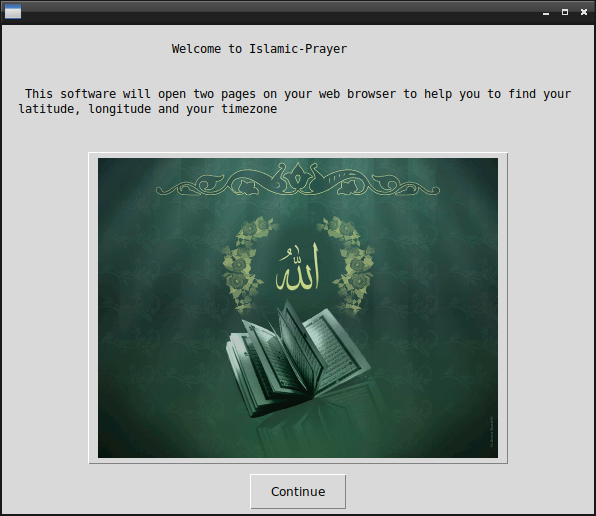
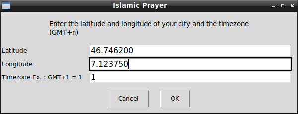
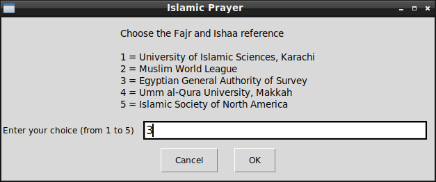
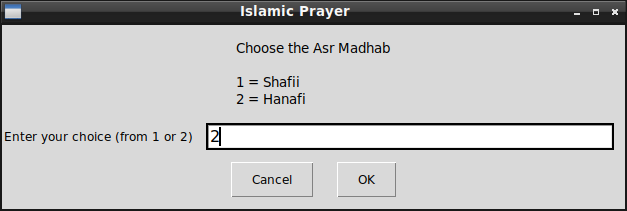
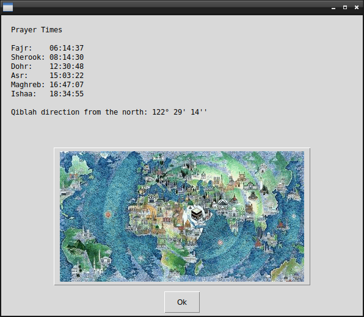

# Islamic Prayer with GUI

## What's this software ?  

This software will open two pages on your web browser to help you to find your latitude, longitude and your timezone.  
It's developed in Python 3 with a GUI.


  
  
  
  
  


## What you need to make it work :  

This game is made for Python 3.  

Install all the packages for : Python 3.  

easygui at least version 0.98  

```sh
sudo python3 -m pip install --upgrade easygui  
```  


## How to launch this software :  

```sh
python3 islamic-prayer.py  
```  


## Developer - Author  

Hamdy Abou El Anein  

